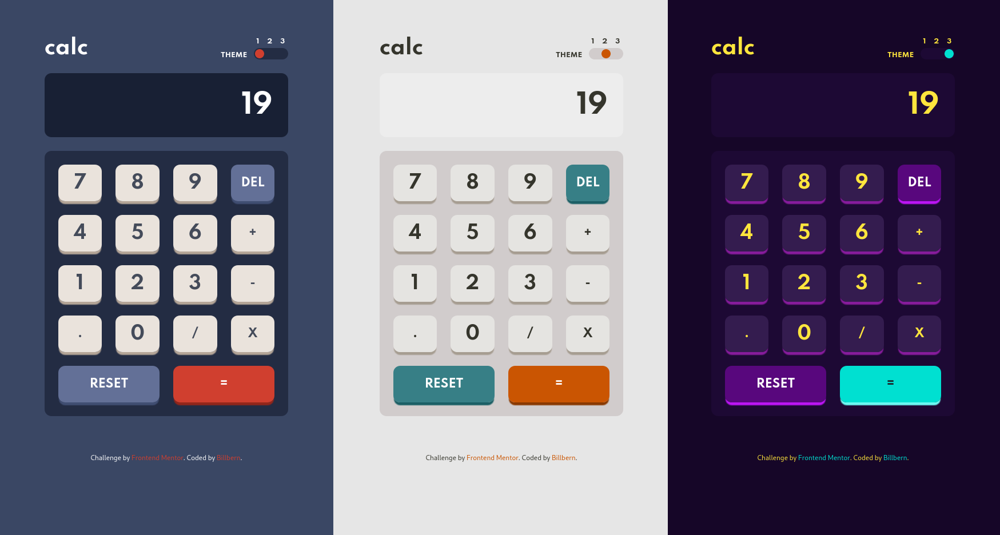

# Frontend Mentor - Calculator app solution

This is a solution to the [Calculator app challenge on Frontend Mentor](https://www.frontendmentor.io/challenges/calculator-app-9lteq5N29). Frontend Mentor challenges help you improve your coding skills by building realistic projects. 

## Table of contents

- [Overview](#overview)
  - [The challenge](#the-challenge)
  - [Screenshot](#screenshot)
  - [Links](#links)
- [My process](#my-process)
  - [Built with](#built-with)
  - [What I learned](#what-i-learned)
  - [Continued development](#continued-development)
  - [Useful resources](#useful-resources)
- [Author](#author)


## Overview

### The challenge

Users should be able to:

- See the size of the elements adjust based on their device's screen size
- Perform mathmatical operations like addition, subtraction, multiplication, and division
- Adjust the color theme based on their preference
- **Bonus**: Have their initial theme preference checked using `prefers-color-scheme` and have any additional changes saved in the browser

### Screenshot



### Links

- Solution URL: [Calculator App](https://github.com/Billbern/CalculatorApp.git)
- Live Site URL: [Calculator App](https://mentorcalculatorapp.herokuapp.com/)

## My process

### Built with

- Semantic HTML5 markup
- Tailwindcss
- Flexbox
- CSS Grid
- Mobile-first workflow
- React [Context Api](https://reactjs.org/docs/context.html)
- [React](https://reactjs.org/) - JS library


### What I learned

<!-- Use this section to recap over some of your major learnings while working through this project. Writing these out and providing code samples of areas you want to highlight is a great way to reinforce your own knowledge.

To see how you can add code snippets, see below:

```html
<h1>Some HTML code I'm proud of</h1>
```
```css
.proud-of-this-css {
  color: papayawhip;
}
```
```js
const proudOfThisFunc = () => {
  console.log('🎉')
}
``` -->


### Continued development

The Calculator even though functional has some small bugs that needs fixing also i will like to add history to it so a user can select from his/her calculator history.


### Useful resources

- [Tailwind \`.container\` the right way ](https://dev.to/bourhaouta/tailwind-container-the-right-way-5g77) - This article helped me with customising tailwindcss' default .container config
- [Tailwindcss Official Documentation](https://tailwindcss.com/docs/) - This is the tailwindcss docs which also helped with most class names.


## Author

- Frontend Mentor - [@Billbern](https://www.frontendmentor.io/profile/Billbern)
- Twitter :bird: - [@Kbillgreenz](https://www.twitter.com/Kbillgreenz)


